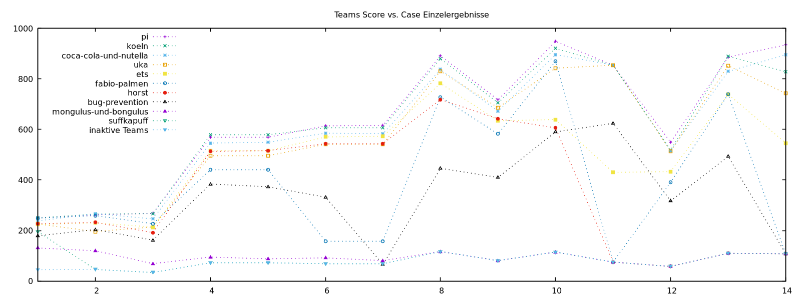

# :1st_place_medal: Team π :trophy: Programmierwettbewerb 2023 (Mathe-dual e.V.)

[](https://www.gnu.org/licenses/gpl-3.0)

## Team π
  - Samuel Thesing [samuel.thesing@rwth-aachen.de](mailto:samuel.thesing@rwth-aachen.de) :octocat: [@Rankail](https://github.com/Rankail)
  - Christian Rene Thelen [christian.thelen@rwth-aachen.de](mailto:christian.thelen@rwth-aachen.de) :octocat: [@cortex359](https://github.com/cortex359)


This repository is one of two repositories we used for conquering the programming competition 2023.
It contains our [best results](results/current_best/README.md) (and a few along the way), [log files](execute/logs), [interesting research](RESEARCH.md), as well as Python scripts to visualize, compare, plot and evaluate the circle packing, run the algorithms in parallel, approximate the [score](scoring/SCORE.md), [scrap](#web-crawler) the webpage with the intermediate score of the other teams, a few other strategic considerations and some miscellaneous shenanigans. [cortex359/md.wettbewerb2023][1]


The other repository contains the actual solver, written in C++ as well as scramblers and the code for creating the images and animations. [Rankail/md-wettbewerb-2023][11]

---

## Final Score
[](https://wettbewerb.mathe-dual.de/)

| Place | Team                       | Bonus | Total Score | Code               |
| ----: | :------------------------- | ----: | ----------: | ------------------ |
|    1. | [pi][1][11]                |   100 |        9025 | [:octocat:][1][11] |
|    2. | [koeln][2]                 |    50 |        8794 | [:octocat:][2]     |
|    3. | [coca-cola-und-nutella][3] |    25 |        8538 | [:octocat:][3]     |
|    4. | uka                        |       |        8030 |                    |
|    5. | ets                        |       |        7046 |                    |
|    6. | fabio-palmen               |       |        5424 |                    |
|    7. | horst                      |       |        5085 |                    |
|    8. | bug-prevention             |       |        4688 |                    |
|    9. | mongulus-und-bongulus      |       |        1340 |                    |
|   10. | suffkapuff                 |       |        1220 |                    |

[1]: https://github.com/cortex359/md.wettbewerb2023
[11]: https://github.com/Rankail/md-wettbewerb-2023
[2]: https://github.com/JoJoCheck/Programmierwettbewerb-Team-Koeln
[3]: https://github.com/Dekay21/MatheDualWettbewerb_C-N

## Mathe-dual e.V.

:de: [Blog Post](https://mathe-dual.de/index.php/2-uncategorised/52-siegerehrung-und-preisverleihung-programmierwettbewerb-2023) über die Siegerehrung, [Finale Auswertung](https://wettbewerb.mathe-dual.de/)
und [Vergleichsübersicht](https://wettbewerb.mathedual.de/index_main.html),
sowie allgemeine [Informationen](https://www.mathe-dual.de/index.php/wettbewerb-link) über den Wettbewerb auf [mathe-dual.de](https://www.mathe-dual.de).


# This Repository

[](https://github.com/cortex359/md.wettbewerb2023)

A list with relevant research publications can be found here: [RESEARCH.md](RESEARCH.md)

An overview over our best results: [results/current_best/README.md](results/current_best/README.md)

The latest comparisons of our results with other teams:
- [Final Overview](web/relative_score_tables/overview-final.md)
- [2023-03-06 22:48](web/relative_score_tables/overview-2023-03-06_22-48.md)
- [2023-03-06 16:03](web/relative_score_tables/overview-2023-03-06_16-03.md)
- [2023-03-06 10:43](web/relative_score_tables/overview-2023-03-06_10-43.md)
- [2023-03-05 22:50](web/relative_score_tables/overview-2023-03-05_22-50.md)
- [2023-03-05 21:38](web/relative_score_tables/overview-2023-03-05_21-38.md)


## Installation

In order to use the python scripts, some packages need to be installed in your environment.

```zsh
pip install -r requirements.txt
```

## Web crawler

### Usage
Generate relative score tables:

Fetch snapshots with `python webcrawler.py` and extract current snapshot.zip:

```zsh
snapshot="snapshot_060323_2300"
teams=( koeln coca-cola-und-nutella uka ets fabio-palmen bug-prevention horst )

for t in $teams; do
  mkdir "web/data/${t}/${snapshot}"
  unzip -d "web/data/${t}/${snapshot}" "web/data/${t}/${snapshot}.zip"
done
```

Enter the group directory and extract tables:

```zsh
for t in ${teams}; do
  for i in {01..14} ; do
    pcre2grep -Me '(?:<pre>)([^<]+[\n\s]*)+(?:<\/pre>)' -m1 --output '$1' web/data/${t}/${snapshot}/forest${i}.txt.html >| web/data/${t}/${t}.forest${i}.table
  done
done
```

parse tables and save relative scores:

```zsh
{
  for i in {01..14} ; do
    python web/score_webtable.py forest${i} ${teams};
  done
} >| web/relative_score_tables/overview-$(date +'%F_%H-%M').md
```

