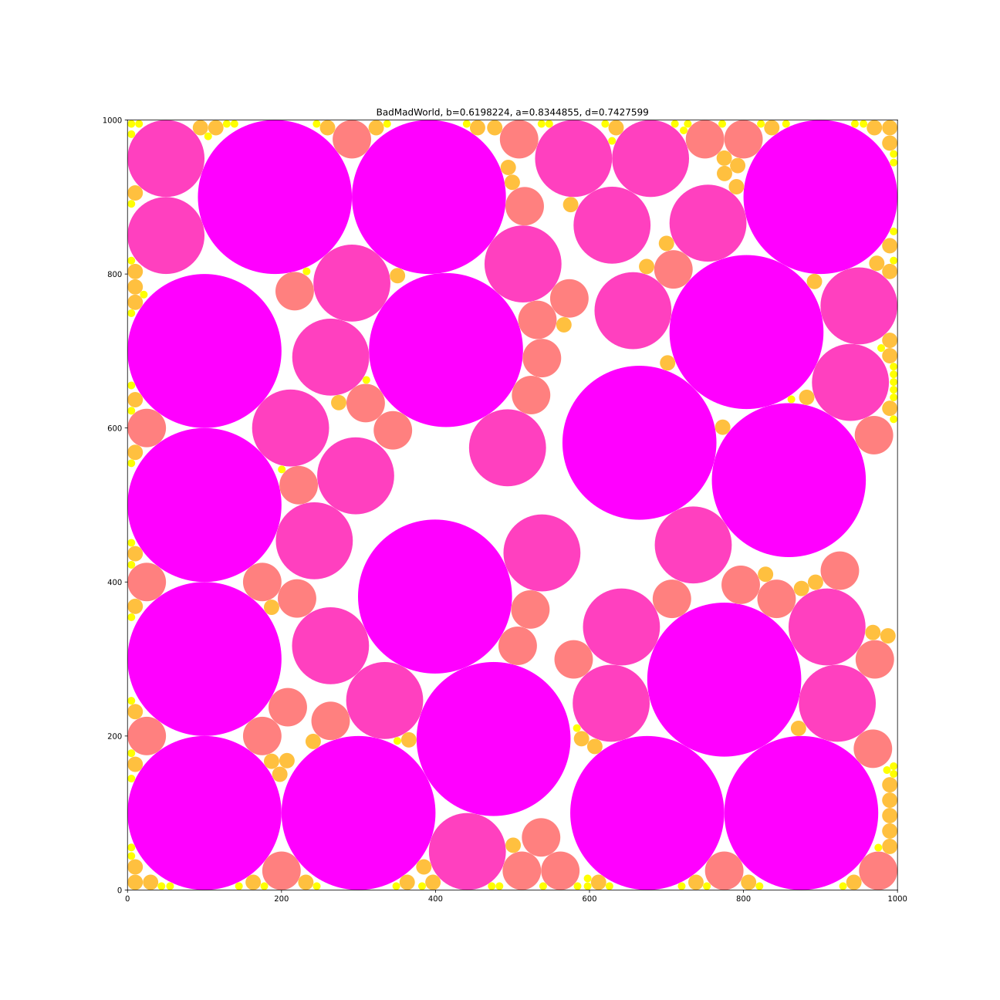
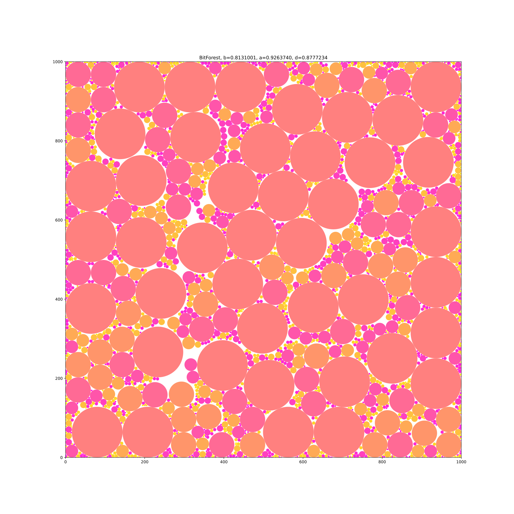
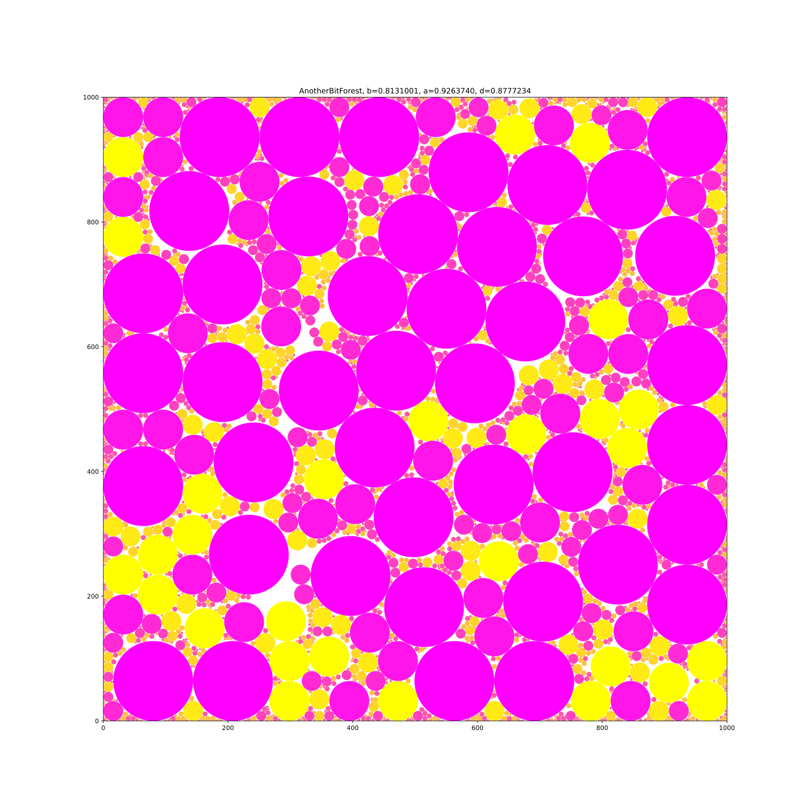
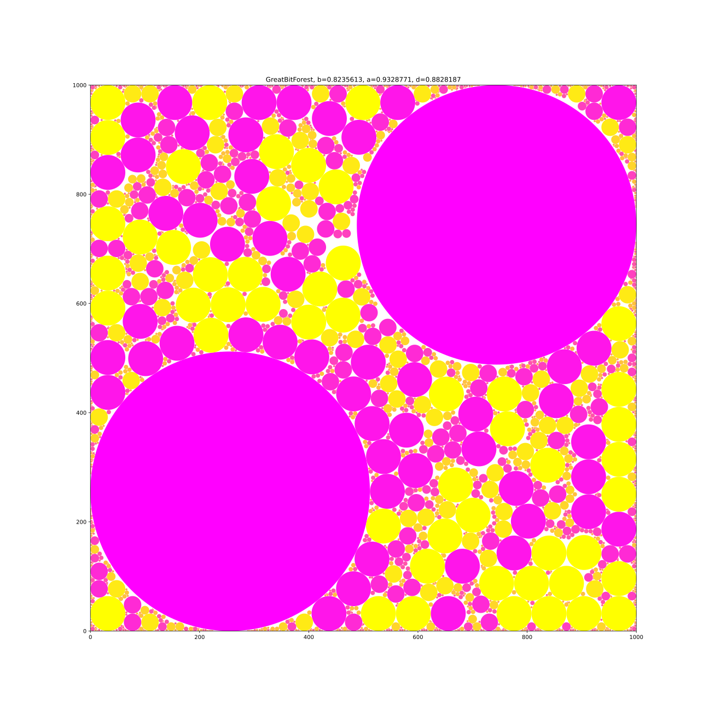
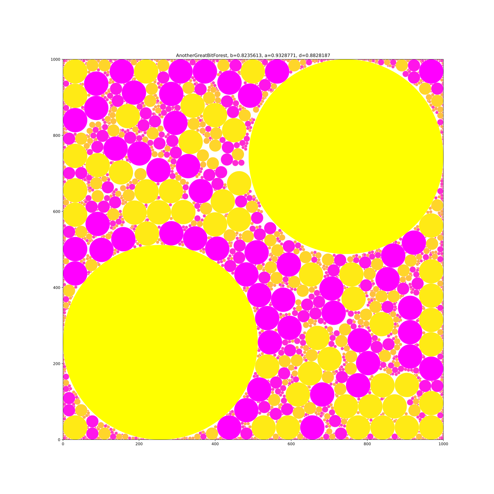
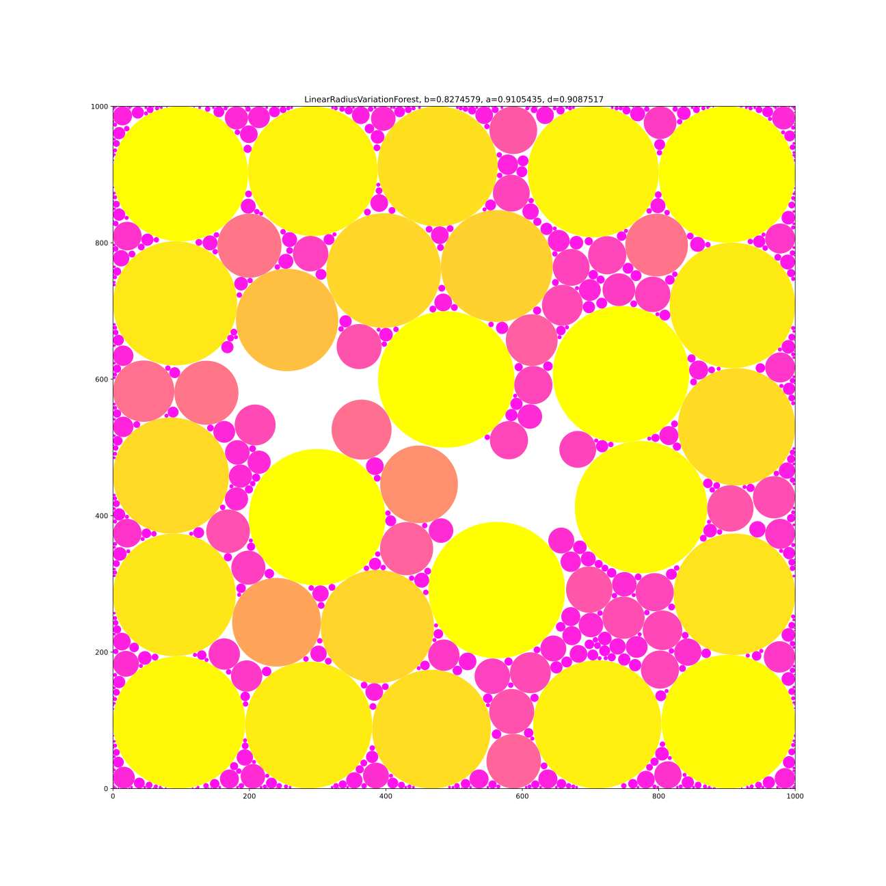
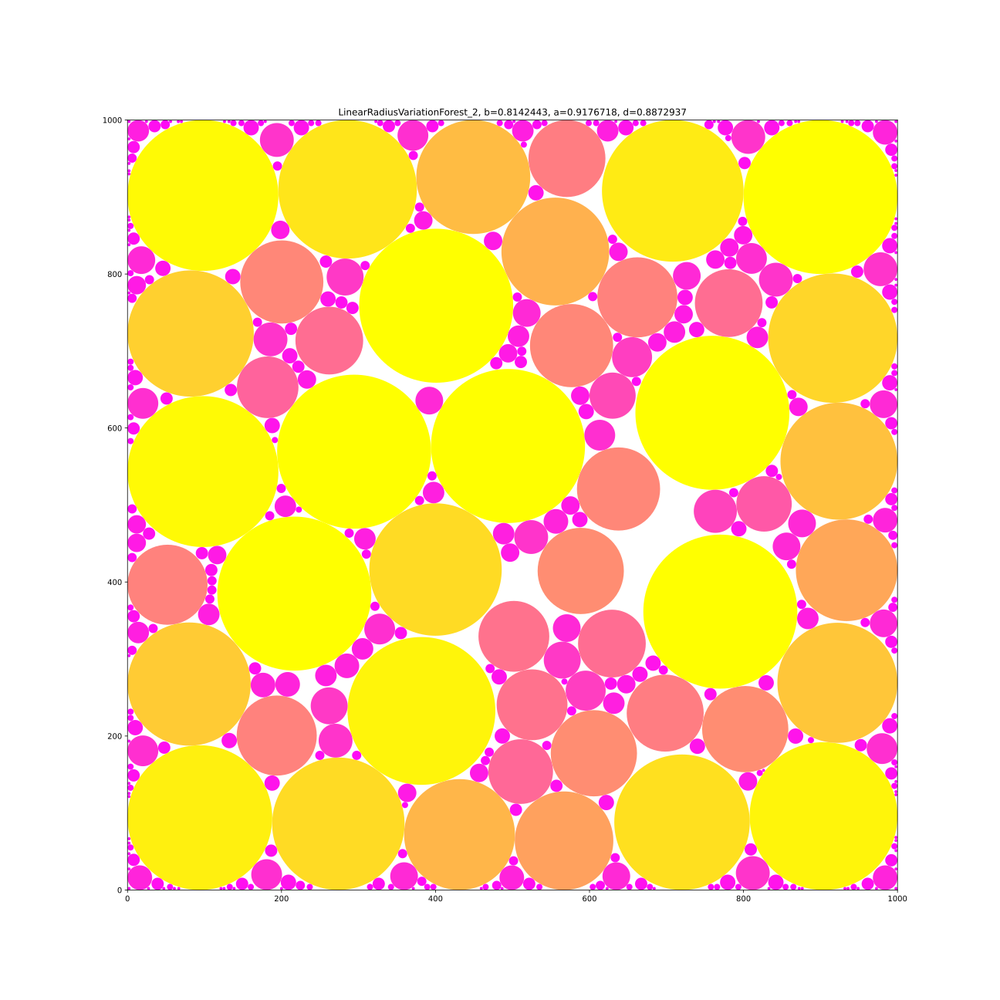
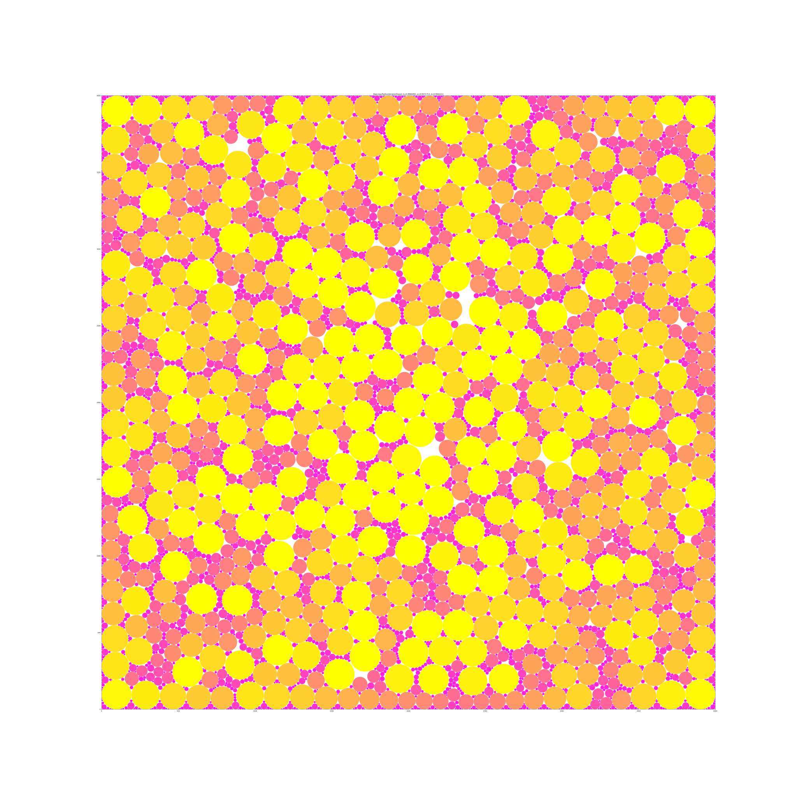

# Results

| b | a | d | map file | test case |
|---|---|---|----------|-----------|
| 0.66705719 | 0.83500391 | 0.79886714 | result_files/forest01.txt | SherwoodForest |
| 0.68763112 | 0.86185825 | 0.79784712 | result_files/forest02.txt | MadWorld |
| 0.61982242 | 0.83448555 | 0.74275992 | result_files/forest03.txt | BadMadWorld |
| 0.81310010 | 0.92637399 | 0.87772337 | result_files/forest04.txt | BitForest |
| 0.81310010 | 0.92637399 | 0.87772337 | result_files/forest05.txt | AnotherBitForest |
| 0.82356134 | 0.93287709 | 0.88281870 | result_files/forest06.txt | GreatBitForest |
| 0.82356134 | 0.93287709 | 0.88281870 | result_files/forest07.txt | AnotherGreatBitForest |
| 0.82745794 | 0.91054351 | 0.90875168 | result_files/forest08.txt | LinearRadiusVariationForest |
| 0.81424434 | 0.91767178 | 0.88729365 | result_files/forest09.txt | LinearRadiusVariationForest_2 |
| 0.89604918 | 0.93717125 | 0.95612107 | result_files/forest10.txt | BigLinearRadiusVariationForest |

Forest01: 

Forest02: 

Forest03: 

Forest04: 

Forest05: 

Forest06: 

Forest07: 

Forest08: 

Forest09: 

Forest10: 
