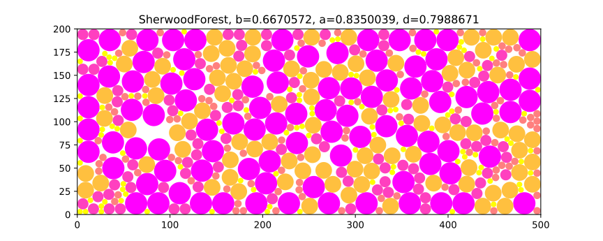
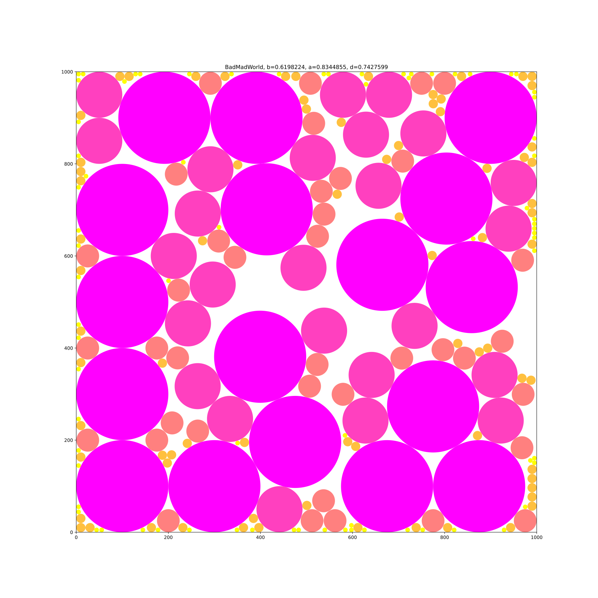

# Results

b:0.66705719 a:0.83500391 d:0.79886714 result_files/forest01.txt SherwoodForest
b:0.68763112 a:0.86185825 d:0.79784712 result_files/forest02.txt MadWorld
b:0.61982242 a:0.83448555 d:0.74275992 result_files/forest03.txt BadMadWorld
b:0.81310010 a:0.92637399 d:0.87772337 result_files/forest04.txt BitForest
b:0.81310010 a:0.92637399 d:0.87772337 result_files/forest05.txt AnotherBitForest
b:0.82356134 a:0.93287709 d:0.88281870 result_files/forest06.txt GreatBitForest
b:0.82356134 a:0.93287709 d:0.88281870 result_files/forest07.txt AnotherGreatBitForest
b:0.82745794 a:0.91054351 d:0.90875168 result_files/forest08.txt LinearRadiusVariationForest
b:0.81424434 a:0.91767178 d:0.88729365 result_files/forest09.txt LinearRadiusVariationForest_2
b:0.89604918 a:0.93717125 d:0.95612107 result_files/forest10.txt BigLinearRadiusVariationForest

Forest01: 

Forest02: 

Forest03: 

Forest04: 

Forest05: 

Forest06: 

Forest07: 

Forest08: 

Forest09: 

Forest10: 
