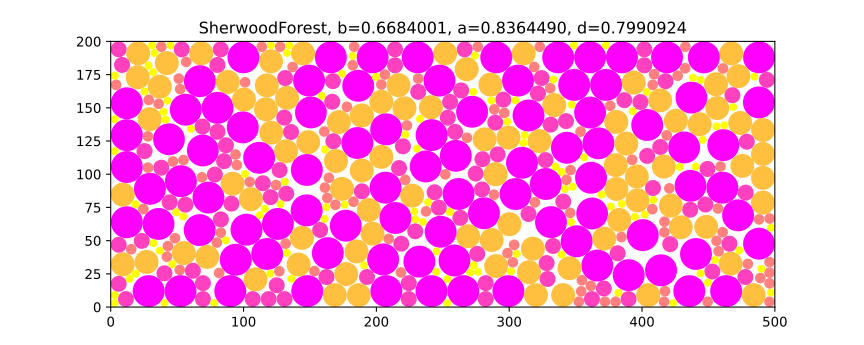
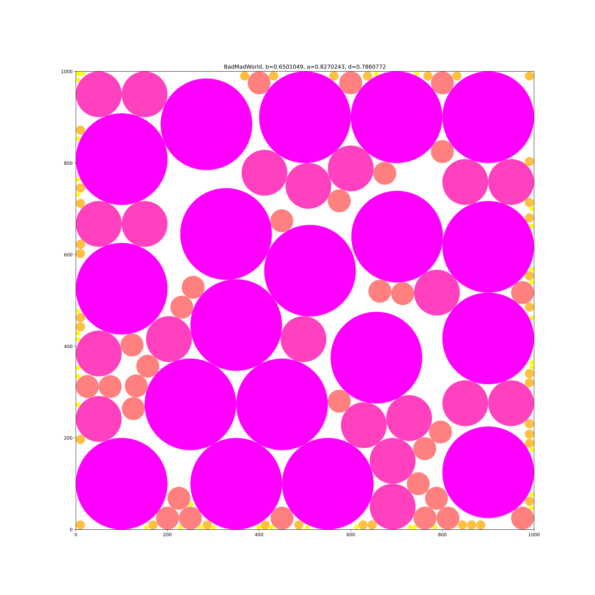
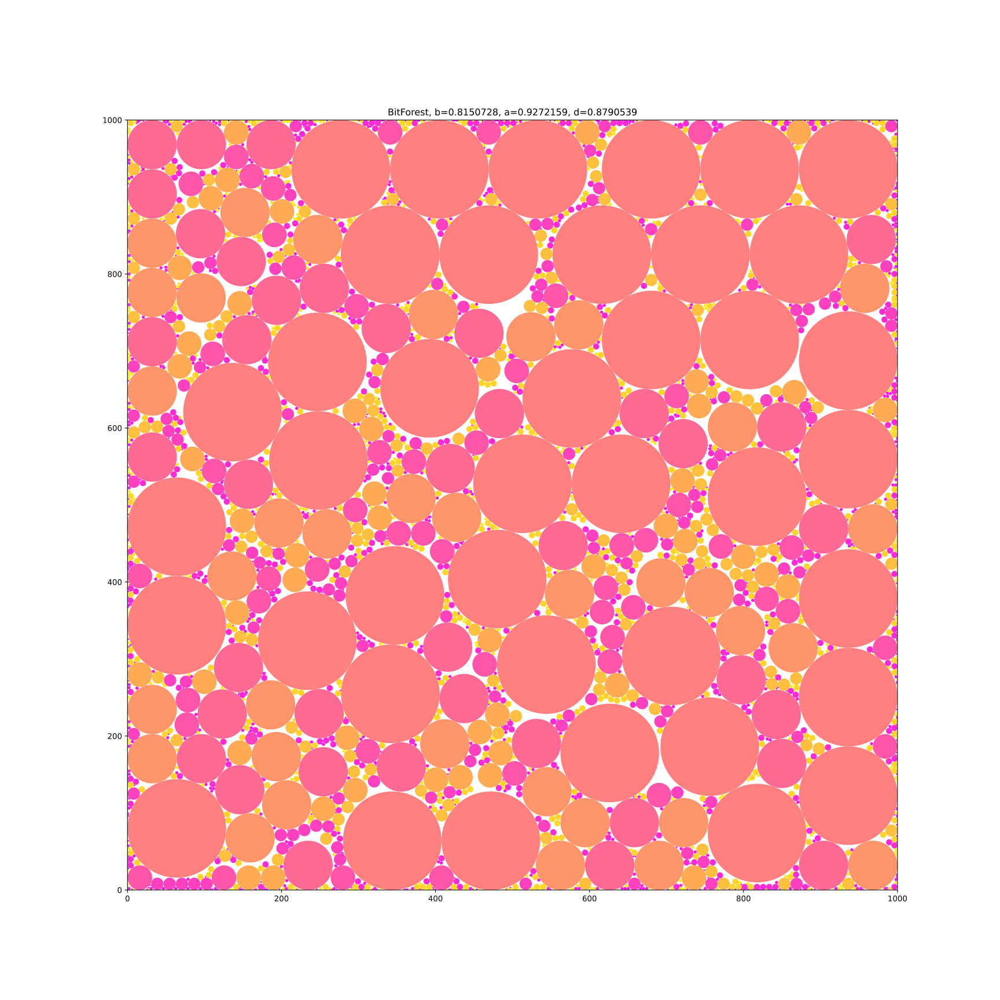
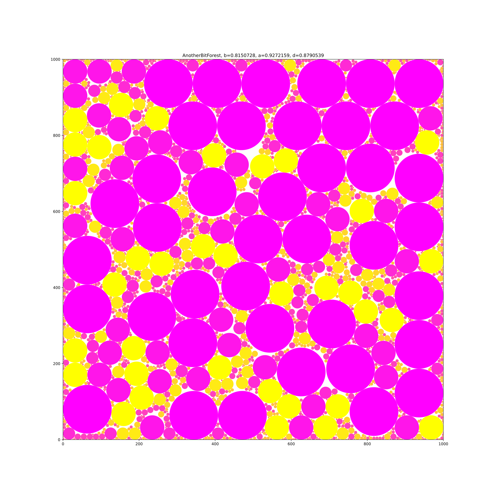
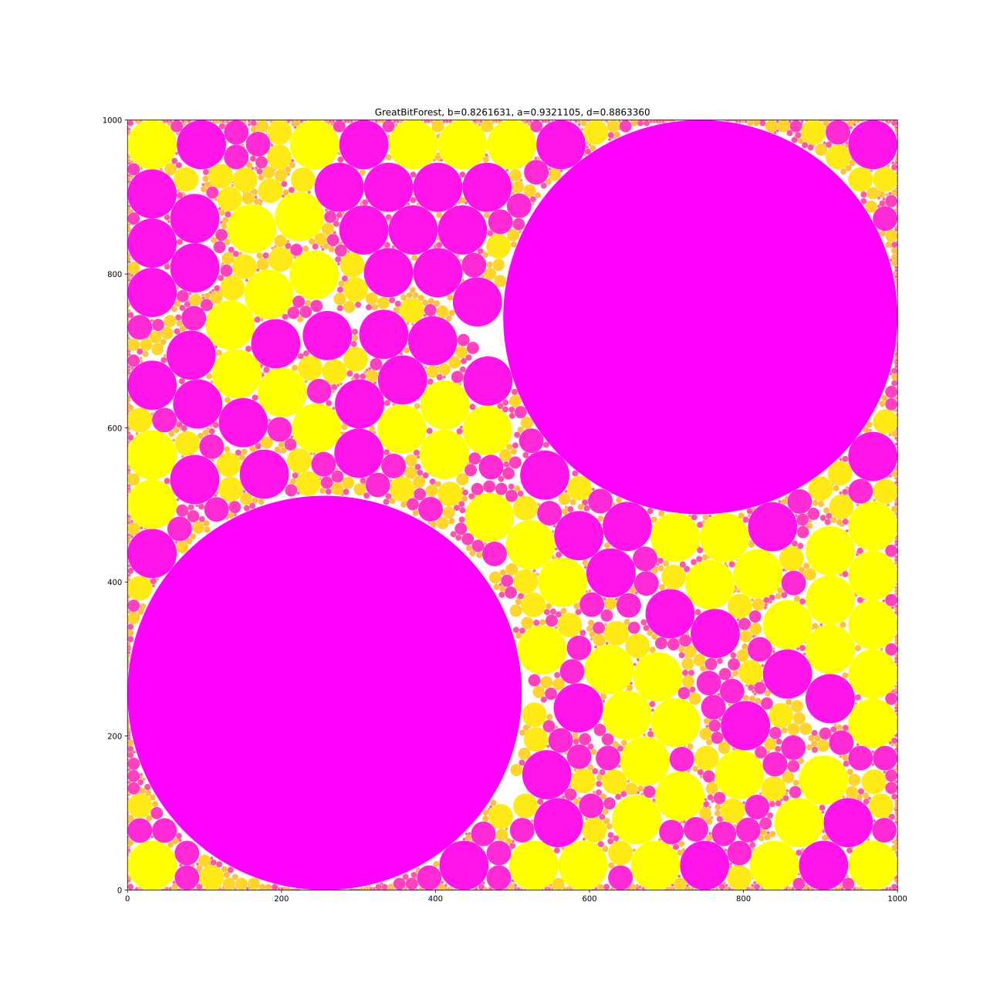
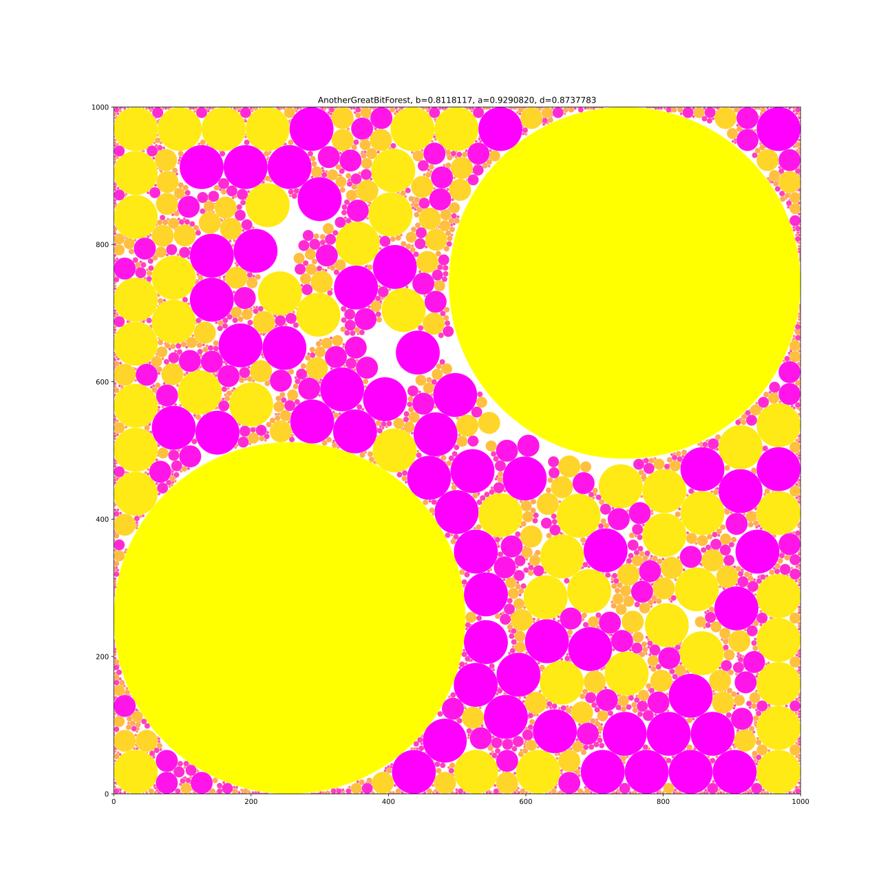
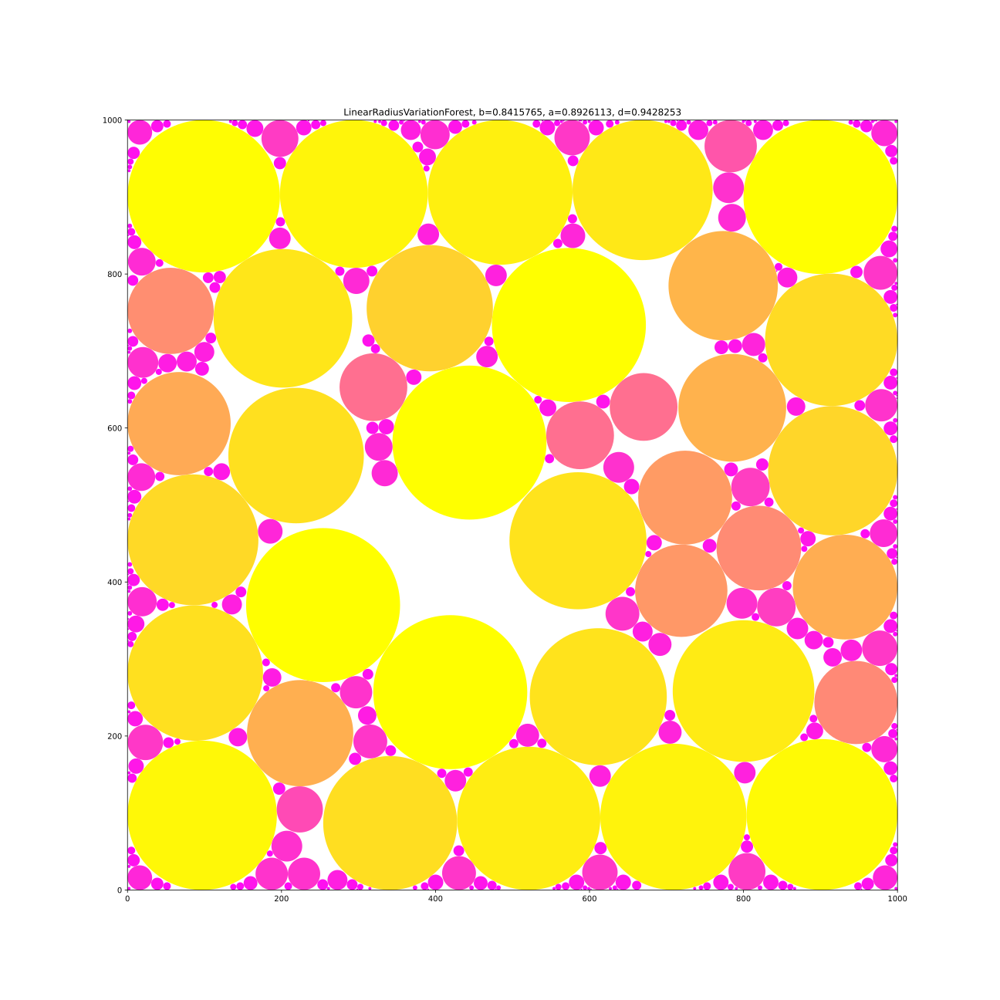
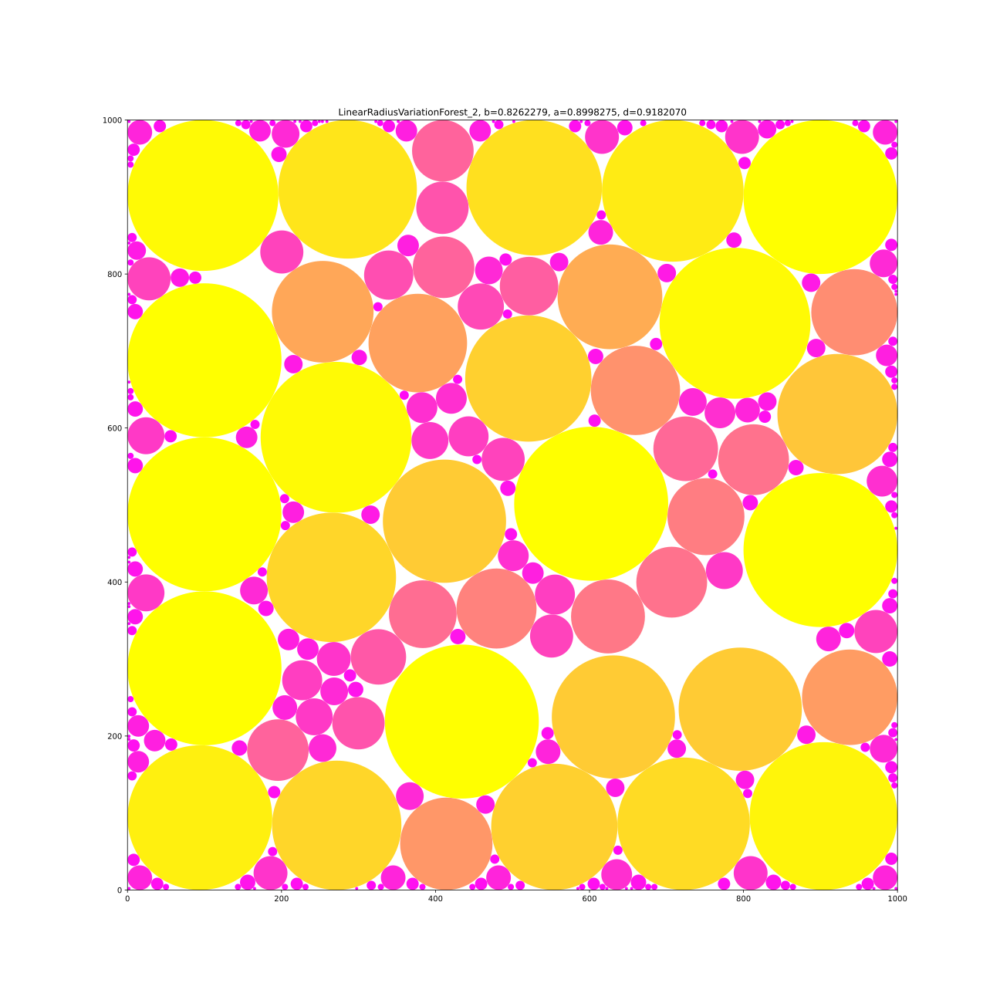
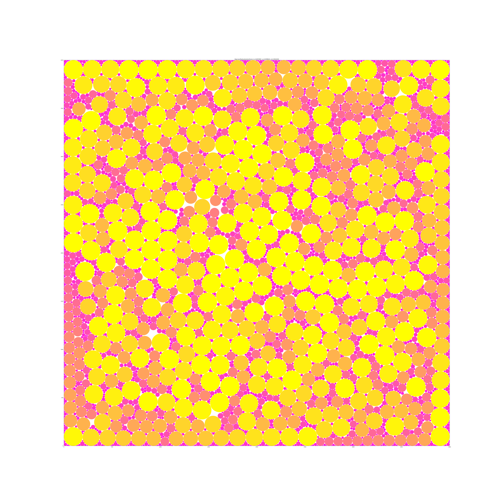

# Results

b:0.66840009 a:0.83644904 d:0.79909242 result_files/forest01.txt SherwoodForest
b:0.68672332 a:0.86149382 d:0.79713087 result_files/forest02.txt MadWorld
b:0.65010489 a:0.82702427 d:0.78607716 result_files/forest03.txt BadMadWorld
b:0.81507276 a:0.92721594 d:0.87905387 result_files/forest04.txt BitForest
b:0.81507276 a:0.92721594 d:0.87905387 result_files/forest05.txt AnotherBitForest
b:0.82616310 a:0.93211054 d:0.88633598 result_files/forest06.txt GreatBitForest
b:0.81181170 a:0.92908205 d:0.87377827 result_files/forest07.txt AnotherGreatBitForest
b:0.84157650 a:0.89261130 d:0.94282528 result_files/forest08.txt LinearRadiusVariationForest
b:0.82622792 a:0.89982753 d:0.91820698 result_files/forest09.txt LinearRadiusVariationForest_2
b:0.89769872 a:0.93996334 d:0.95503588 result_files/forest10.txt BigLinearRadiusVariationForest

Forest01: 

Forest02: 

Forest03: 

Forest04: 

Forest05: 

Forest06: 

Forest07: 

Forest08: 

Forest09: 

Forest10: 
