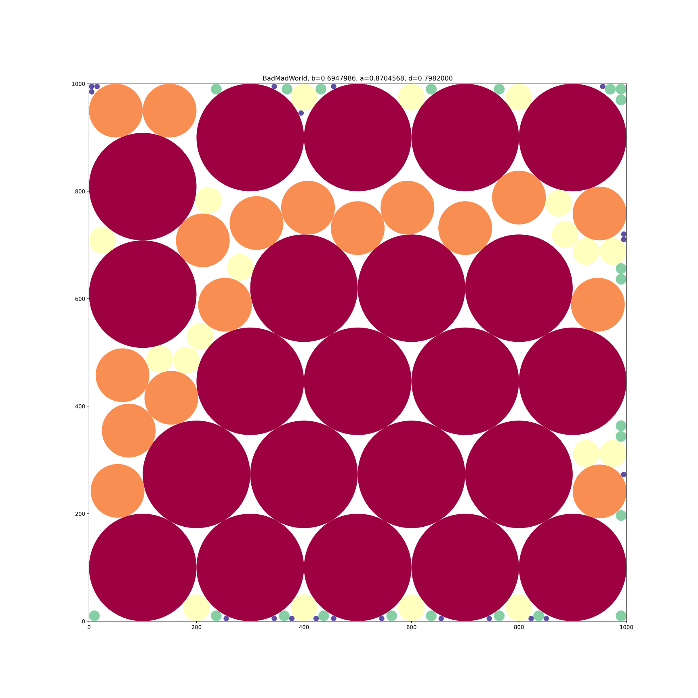
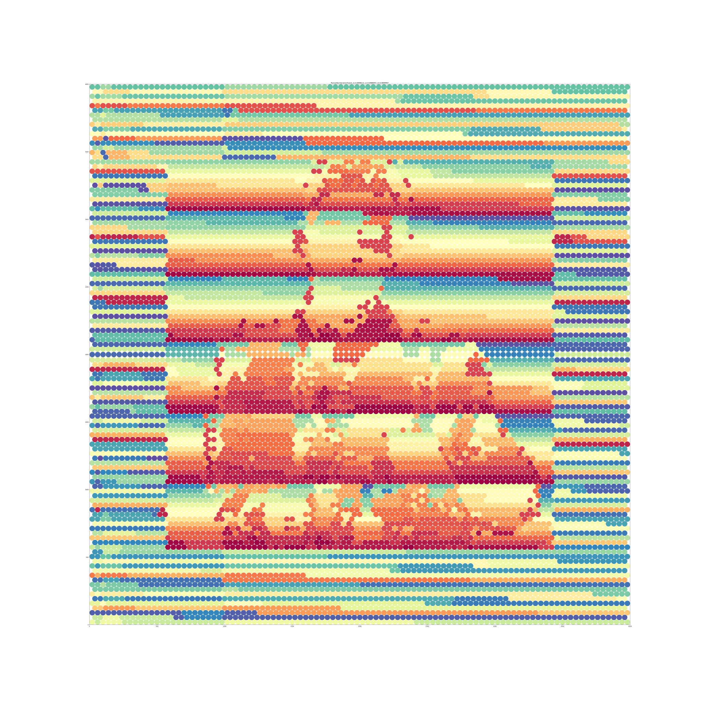
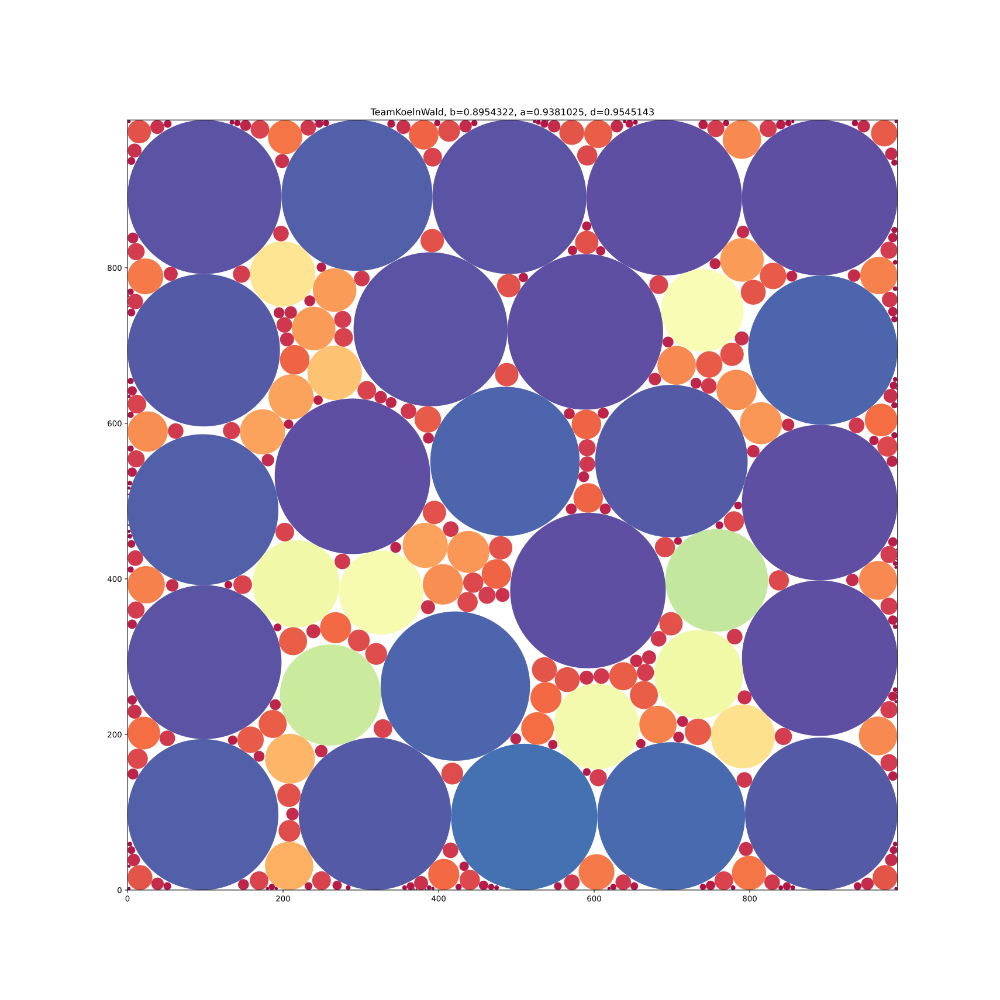

# Results

| Forest | Testcase                         | b                | a            | d          |                  w |    seed |     found at | tag                   |
|-------:|:---------------------------------|------------------|--------------|------------|-------------------:|--------:|-------------:|-----------------------|
|      1 | SherwoodForest                   | 0.68202781245325 | 0.85715214   | 0.79569050 |         0.55188141 | 1265474 |      tsunami | solver.vs8.randomSeed |
|      2 | MadWorld                         | 0.69068135485379 | 0.86644183   | 0.79714683 |            0.17543 |         |      tsunami | solver.vs7.non-det    |
|      3 | BadMadWorld                      | 0.69479860538263 | 0.87045678   | 0.79820000 |         0.17194631 | 1000343 |      tsunami | solver.vs8.randomSeed |
|      4 | BitForest                        | 0.82450314237752 | 0.93611293   | 0.88077316 |             0.4003 |         |      rankail | 2022_02_17            |
|      5 | AnotherBitForest                 | 0.82450314237752 | 0.93611293   | 0.88077316 |             0.4003 |         |      rankail | 2022_02_17            |
|      6 | GreatBitForest                   | 0.83711467416905 | 0.93459868   | 0.89569426 |            unknown |       - |      rankail | 6c269d5c              |
|      7 | AnotherGreatBitForest            | 0.83763051       | 0.93644594   | 0.89447823 | 0.5441333333333329 |         |          hpc | solver.vs7.non-det    |
|      8 | LinearRadiusVariationForest      | 0.89634129748981 | 0.93814868   | 0.95543629 |             0.5054 |         |      tsunami | solver.vs7.non-det    |
|      9 | LinearRadiusVariationForest_2    | 0.86217742116102 | 0.91177815   | 0.94560000 |            unknown |         |      rankail | 6c269d5c              |
|     10 | BigLinearRadiusVariationForest   | 0.90594467       | 0.93863838   | 0.96516901 | 0.2209553333333287 |         |          hpc | solver.vs7.non-det    |
|     11 | RomanNonVariationForest          | 0.88982139       | 0.89880966   | 0.98999981 |              n./A. |   n./A. | Generator.py | optimal_packing       |
|     12 | PalmenWald                       | 0.81901446746411 | 0.87797043   | 0.93284972 |           0.211168 |         |      tsunami | solver.vs7.non-det    |
|     13 | TeamKoelnWald                    | 0.89543219263548 | 0.93810245   | 0.95451429 |         0.40204082 | 1008110 |          hpc | solver.vs8.randomSeed |
|     14 | GeneticExperimentationForest     | 0.90364587821510 | 0.94015145   | 0.96117054 |            unknown |       - |      rankail | 6c269d5c              |

## Forest01

## Forest02

## Forest03

## Forest04

## Forest05

## Forest06

## Forest07

## Forest08

## Forest09

## Forest10

# New Testcases

## Forest11

## Forest12

## Forest13

## Forest14

