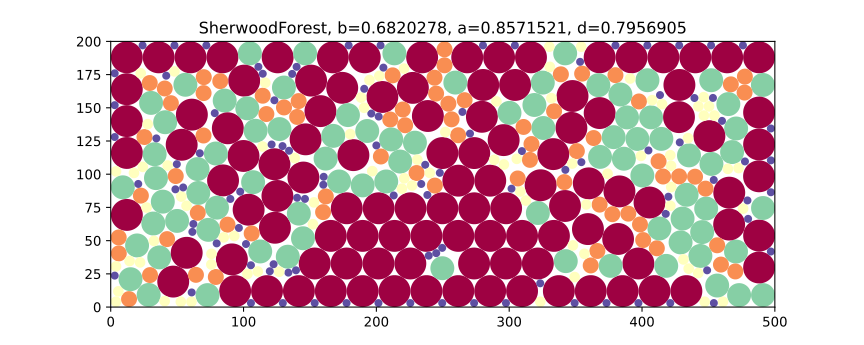
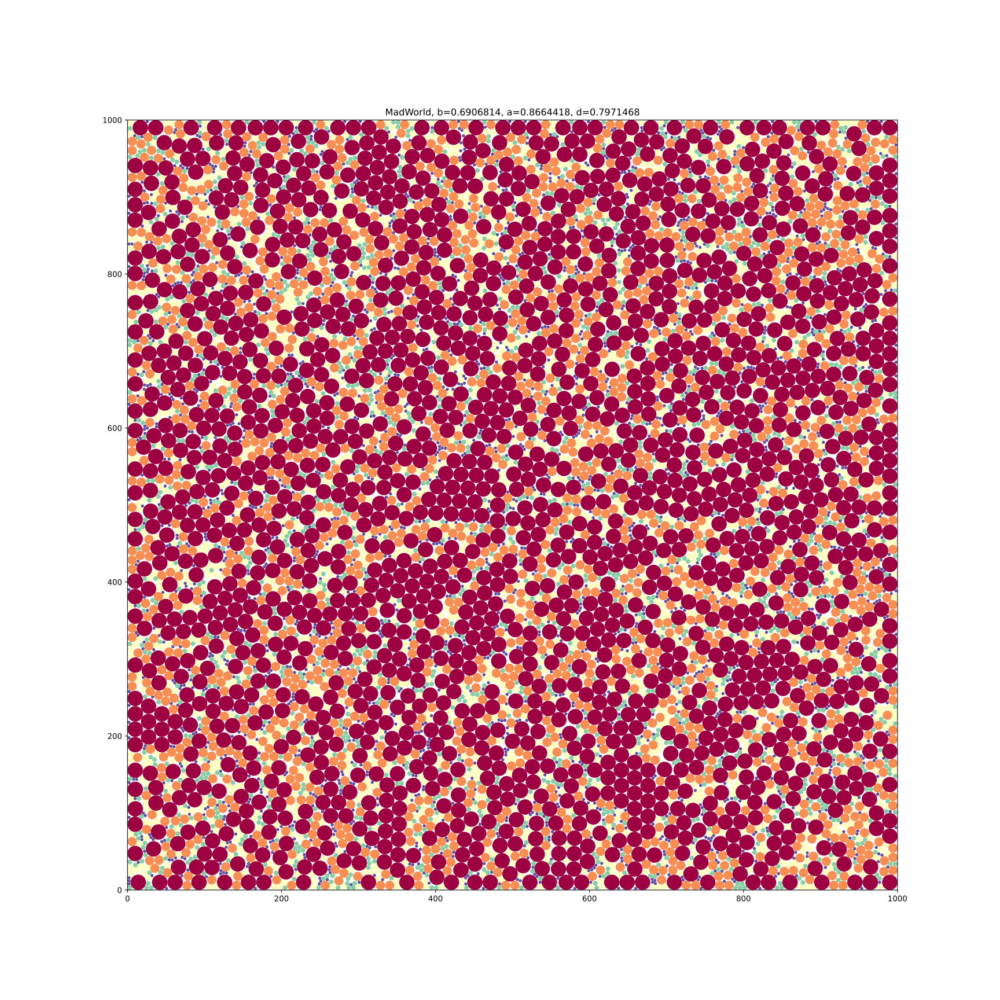
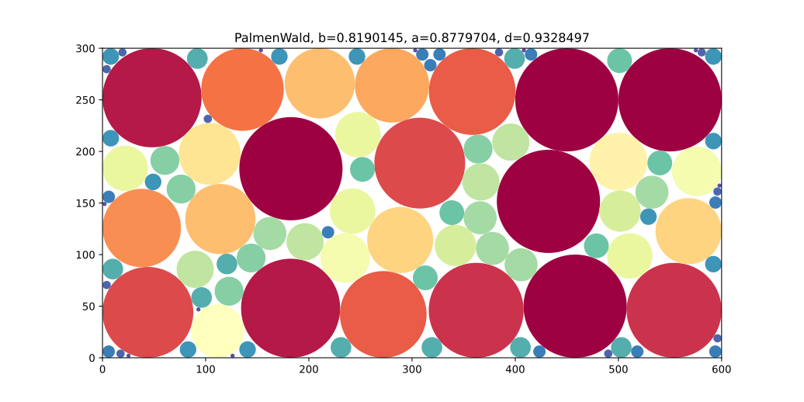

# Results

| Forest | b          | a          | d          | w                  | Testcase                       |
|-------:|------------|------------|------------|:-------------------|--------------------------------|
|      1 | 0.68051383 | 0.85451320 | 0.79637603 | 0.55779666…        | SherwoodForest                 |
|      2 | 0.69002419 | 0.86520090 | 0.79753060 | 0.14485333…        | MadWorld                       |
|      3 | 0.68683635 | 0.86629417 | 0.79284424 | 0.2209553333333287 | BadMadWorld                    |
|      4 | 0.82450314 | 0.93611293 | 0.88077316 | 0.4003             | BitForest                      |
|      5 | 0.82450314 | 0.93611293 | 0.88077316 | 0.4003             | AnotherBitForest               |
|      6 | 0.83680630 | 0.93520187 | 0.89478681 | 0.4516666666666628 | GreatBitForest                 |
|      7 | 0.83763051 | 0.93644594 | 0.89447823 | 0.5441333333333329 | AnotherGreatBitForest          |
|      8 | 0.89629529 | 0.93282682 | 0.96083782 | 0.606666666666666  | LinearRadiusVariationForest    |
|      9 | 0.86202757 | 0.90230311 | 0.95536362 | 0.26648            | LinearRadiusVariationForest_2  |
|     10 | 0.90594467 | 0.93863838 | 0.96516901 | 0.2209553333333287 | BigLinearRadiusVariationForest |
|     11 | 0.88982139 | 0.89880966 | 0.98999981 | n./A.              | RomanNonVariationForest        |
|     12 | 0.81716850 | 0.87336276 | 0.93565760 | 0.56280            | PalmenWald                     |
|     13 | 0.89485890 | 0.93488746 | 0.95718355 | 1.22900            | TeamKoelnWald                  |
|     14 | 0.90355367 | 0.94025497 | 0.96096665 | 0.69250000         |  GeneticExperimentationForest  |

## Forest01

## Forest02

## Forest03

## Forest04

## Forest05

## Forest06

## Forest07

## Forest08

## Forest09

## Forest10

# New Testcases

## Forest11

## Forest12

## Forest13

## Forest14

