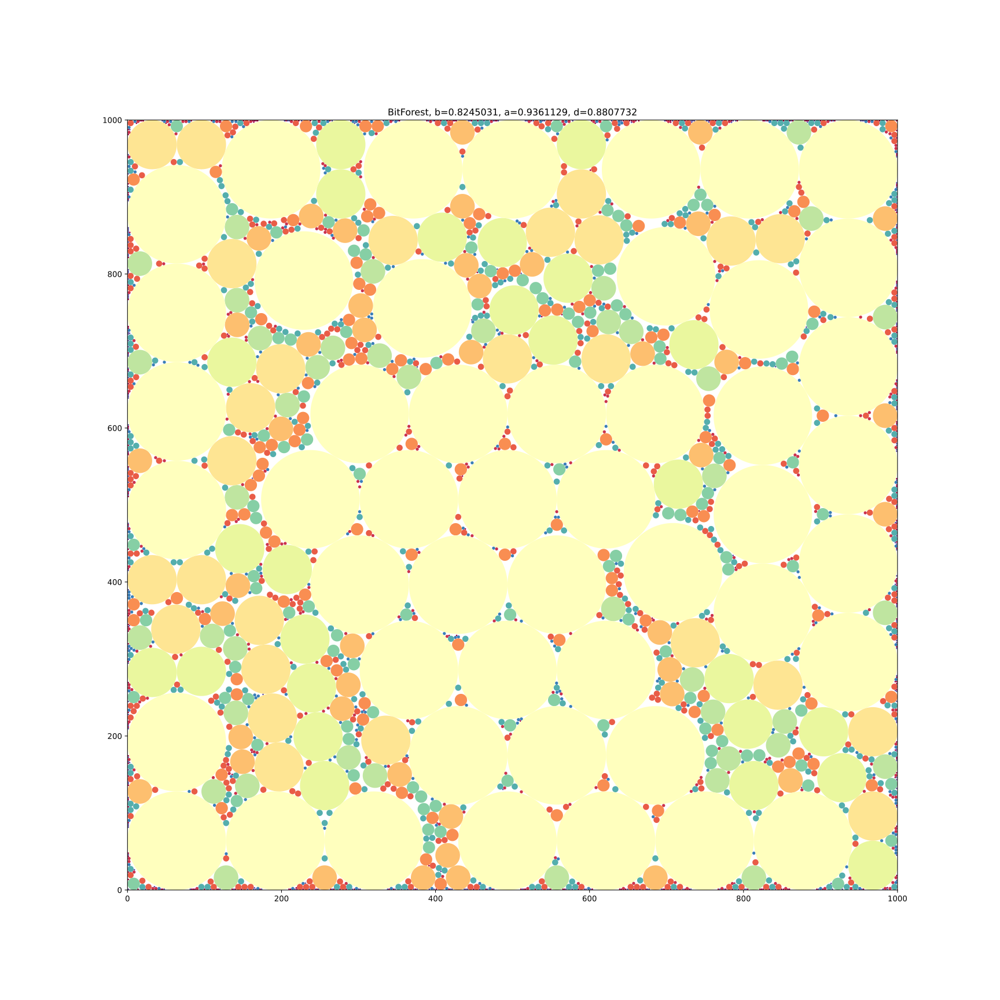
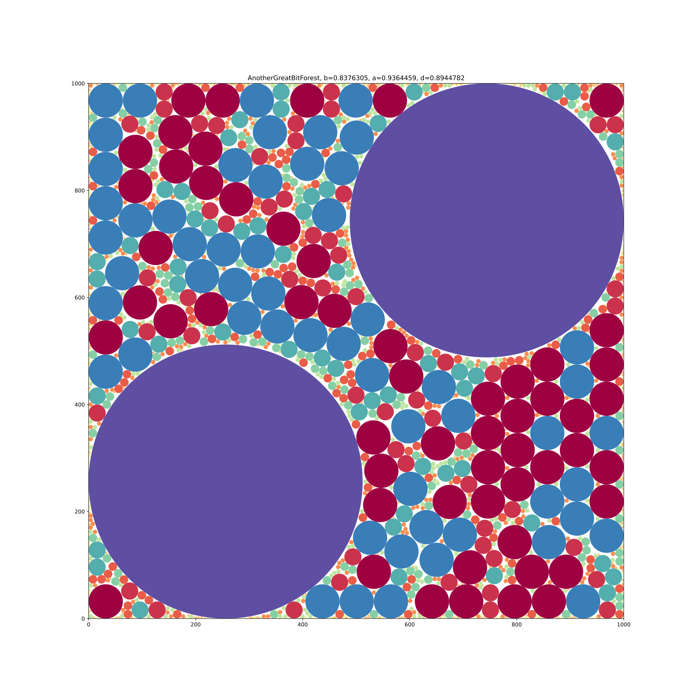
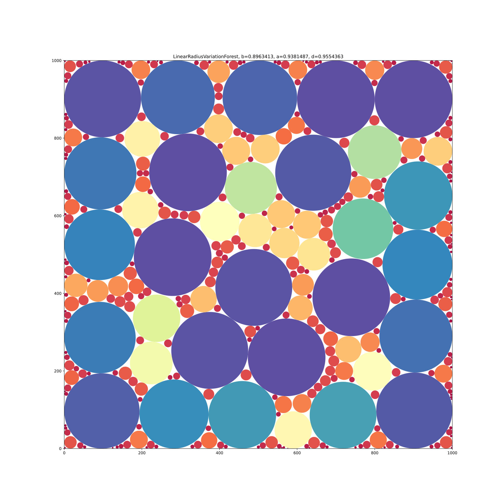
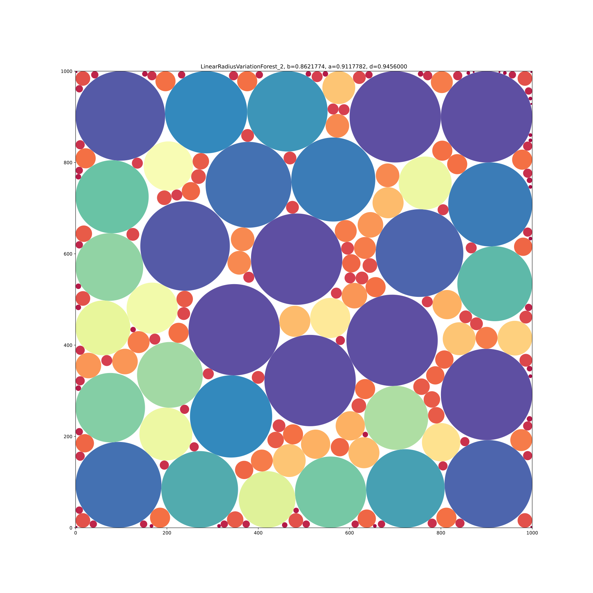

# Results

| b          | a          | d          | Forest | Testcase                       |
|------------|------------|------------|-------:|--------------------------------|
| 0.68051383 | 0.85451320 | 0.79637603 |      1 | SherwoodForest                 |
| 0.69002419 | 0.86520090 | 0.79753060 |      2 | MadWorld                       |
| 0.68683635 | 0.86629417 | 0.79284424 |      3 | BadMadWorld                    |
| 0.82450314 | 0.93611293 | 0.88077316 |      4 | BitForest                      |
| 0.82450314 | 0.93611293 | 0.88077316 |      5 | AnotherBitForest               |
| 0.83680630 | 0.93520187 | 0.89478681 |      6 | GreatBitForest                 |
| 0.83763051 | 0.93644594 | 0.89447823 |      7 | AnotherGreatBitForest          |
| 0.89629529 | 0.93282682 | 0.96083782 |      8 | LinearRadiusVariationForest    |
| 0.86202757 | 0.90230311 | 0.95536362 |      9 | LinearRadiusVariationForest_2  |
| 0.90594467 | 0.93863838 | 0.96516901 |     10 | BigLinearRadiusVariationForest |
| 0.88982139 | 0.89880966 | 0.98999981 |     11 | RomanNonVariationForest        |
| 0.81716850 | 0.87336276 | 0.93565760 |     12 | PalmenWald                     |
| 0.89485890 | 0.93488746 | 0.95718355 |     13 | TeamKoelnWald                  |
| 0.90355367 | 0.94025497 | 0.96096665 |     14 |  GeneticExperimentationForest  |

## Forest01

## Forest02

## Forest03

## Forest04

## Forest05

## Forest06

## Forest07

## Forest08

## Forest09

## Forest10

# New Testcases

## Forest11

## Forest12

## Forest13

## Forest14

