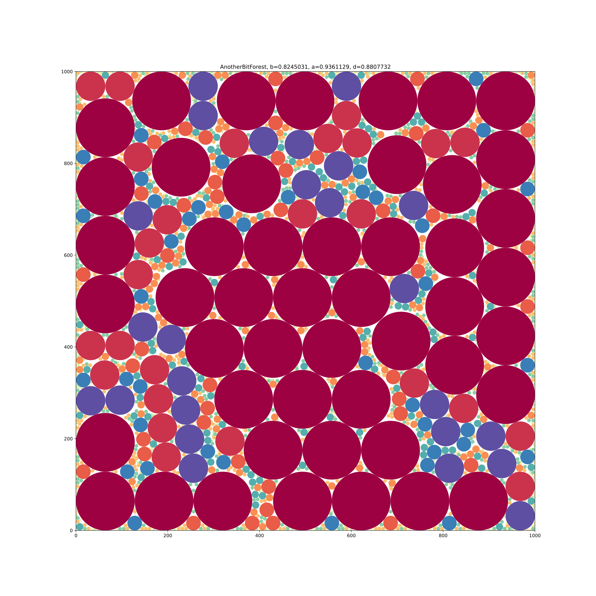
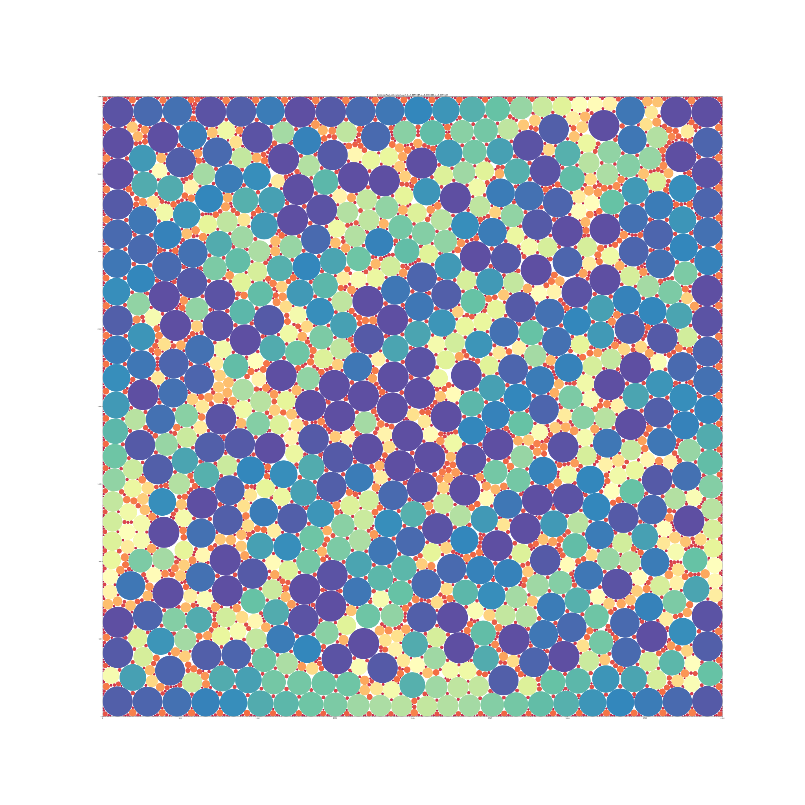

# Results

| Forest | b                | a          | d          |                  w | Testcase                       |
|-------:|------------------|------------|------------|-------------------:|--------------------------------|
|      1 | 0.68051383       | 0.85451320 | 0.79637603 |        0.55779666… | SherwoodForest                 |
|      2 | 0.69068135485379 | 0.86644183 | 0.79714683 |            0.17543 | MadWorld                       |
|      3 | 0.68969426024214 | 0.86299550 | 0.79918639 |         0.17161392 | BadMadWorld                    |
|      4 | 0.82450314237752 | 0.93611293 | 0.88077316 |             0.4003 | BitForest                      |
|      5 | 0.82450314237752 | 0.93611293 | 0.88077316 |             0.4003 | AnotherBitForest               |
|      6 | 0.83680630       | 0.93520187 | 0.89478681 | 0.4516666666666628 | GreatBitForest                 |
|      7 | 0.83763051       | 0.93644594 | 0.89447823 | 0.5441333333333329 | AnotherGreatBitForest          |
|      8 | 0.89634129748981 | 0.93814868 | 0.95543629 |             0.5054 | LinearRadiusVariationForest    |
|      9 | 0.86202756762231 | 0.90230311 | 0.95536362 |            0.26648 | LinearRadiusVariationForest_2  |
|     10 | 0.90594467       | 0.93863838 | 0.96516901 | 0.2209553333333287 | BigLinearRadiusVariationForest |
|     11 | 0.88982139       | 0.89880966 | 0.98999981 |                    | RomanNonVariationForest        |
|     12 | 0.81901446746411 | 0.87797043 | 0.93284972 |           0.211168 | PalmenWald                     |
|     13 | 0.89485889749460 | 0.93488746 | 0.95718355 |            1.22900 | TeamKoelnWald                  |
|     14 | 0.90355367058712 | 0.94025497 | 0.96096665 |             0.6925 | GeneticExperimentationForest   |

## Forest01

## Forest02

## Forest03

## Forest04

## Forest05

## Forest06

## Forest07

## Forest08

## Forest09

## Forest10

# New Testcases

## Forest11

## Forest12

## Forest13

## Forest14

